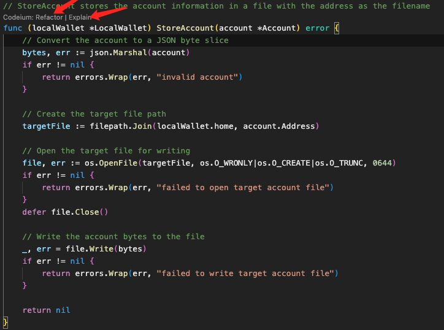
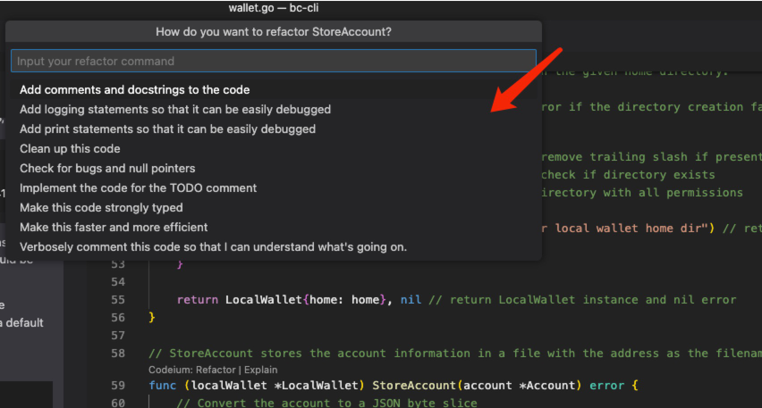
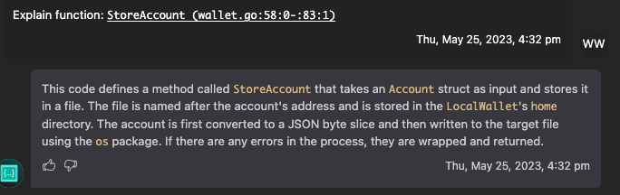
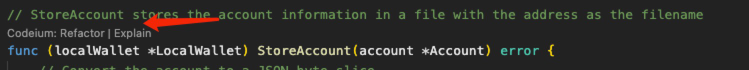
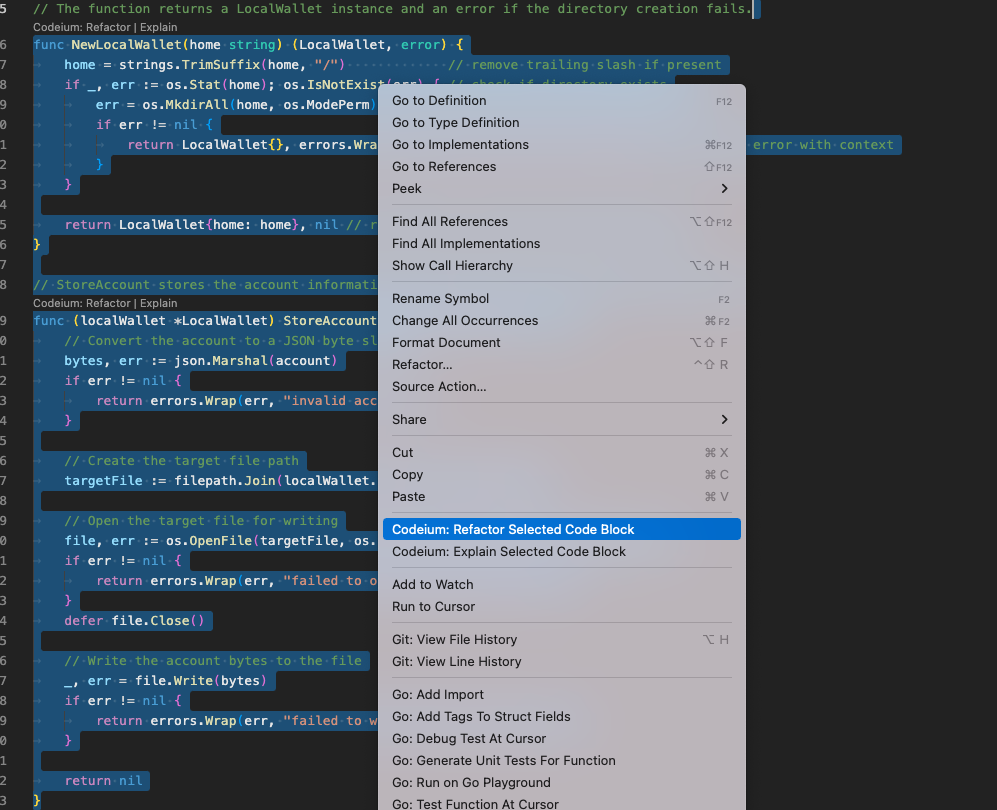
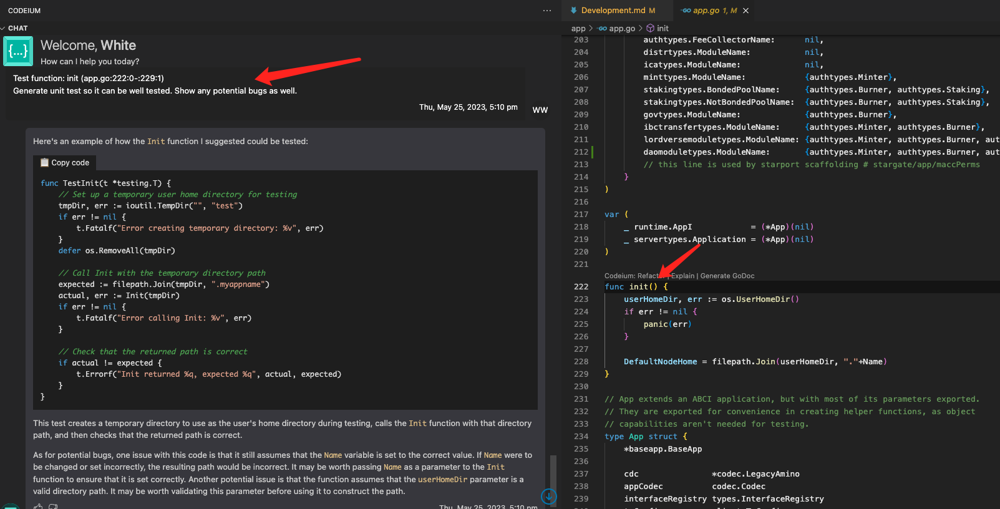

# Enhancing Coding Experience with VSCode and Codeium AI

[VSCode](https://code.visualstudio.com/) is a flexible and widely adopted source code editor with a rich extension ecosystem. By integrating Codeium AI, an advanced language model, you can harness powerful artificial intelligence capabilities directly within VSCode. This guide will walk you through the steps to set up and use VSCode with Codeium AI to enhance your coding efficiency.

## Prerequisites

Before getting started, make sure you have the following prerequisites:

- VSCode installed on your computer.
- Codeium AI extension installed in VSCode (refer to the installation instructions in the [official documentation](https://codeium.dev/)).

## Getting Started

1. Open VSCode on your computer.

2. Install the Codeium AI extension from the VSCode Extension Marketplace.

3. Open a project or create a new one in VSCode.

4. Configure the Codeium AI extension:
   - Open VSCode settings (`File -> Preferences -> Settings`, or press `Ctrl + ,`).
   - Search for "codeium" to find the settings for the Codeium AI extension.
   - Adjust the settings according to your preferences, such as model selection, auto-completion behavior, etc.

5. Code with Codeium AI:
   - As you type in your code files, Codeium AI will provide AI-assisted suggestions, including auto-completion, code snippets, and code corrections.
   - Pay attention to the AI-assisted suggestions and leverage them to accelerate your coding process.
   - Codeium AI can provide suggestions based on code context, previous lines, and common programming patterns.

6. Utilize advanced features:
   - Generate code with Codeium AI: If you need to generate code snippets or templates, you can quickly generate boilerplate code for various programming languages or frameworks using Codeium AI.
   - Get code explanations: If you come across unfamiliar code or want to understand specific concepts, you can request explanations or clarifications from Codeium AI. Simply select the code or place the cursor on the relevant line and access the appropriate Codeium AI command to get detailed explanations.

7. Explore additional features and commands:
   - Familiarize yourself with the available Codeium AI commands and shortcuts. These commands may include commands for code auto-completion, generating code snippets, or getting code explanations.
   - Refer to the Codeium AI extension documentation for a comprehensive list of commands and usage instructions.

## Practice

The Codeium VSCode plugin supports two usage modes:

- Using the built-in Prompt commands.
- Using the dialogs provided by the plugin.

### Using the built-in Prompt commands

The built-in Prompt commands (**without unit tests by default, generated through dialogs**) are integrated within the plugin and include:



1. Refactor



The prompts include:

a. Add comments

```text
Refactor function: init (app.go:222:0-:229:1)

Add comments and docstrings to the code
```

b. Optimize code

```text
Refactor function: init (app.go:222:0-:229:1)

Make this faster and more efficient
```

c. Check for bugs and fix

```text
Refactor function: init (app.go:222:0-:229:1)

Check for bugs such as null pointer references, unhandled exceptions, and more. If you don't see anything obvious, reply that things look good and that the user can reply with a stack trace to get more information.
```

d. Add logging

```text
Refactor function: init (app.go:222:0-:229:

1)

Add logging statements so that it can be easily debugged
```

e. Add print statements

```text
Refactor function: init (app.go:222:0-:229:1)

Add print statements so that it can be easily debugged
```

f. Clean up code

```text
Refactor function: init (app.go:222:0-:229:1)

Clean up this code by standardizing variable names, removing debugging statements, improving readability, and more. Explain what you did to clean it up in a short and concise way.
```

2. Explain: Detailed explanation of a method

Prompt:

```text
Explain function: NewAccountKeeper (keeper.go:72:0-:97:1)
```



Both built-in Prompt commands can be used in two ways:

1. Clicking the editor command for a specific method.



2. Selecting a code block and right-clicking to choose the Prompt command.



### Using the Dialogs

Examples of effective Prompt usage are as follows:

#### 1. Generate unit tests

```text
Test function: init (app.go:222:0-:229:1)
Generate unit tests so it can be well tested. Show any potential bugs as well.
```

This command will generate unit tests for the **code from line 222 to 229 in the current vscode window file app.go** and show any potential bugs.



Tips:

1. Keep individual functions focused on a single functionality for more accurate and ready-to-use generated unit tests.
2. For methods involving system calls or complex business logic, manual modification might be required.

## Tips for Effective Usage

- Try different AI models: Codeium AI provides different language models trained on various codebases. Experiment with different models to find the one that suits your coding style and needs.

- Review and validate AI suggestions: While Codeium AI can provide helpful suggestions, it's important to review and validate the suggestions before applying them to your codebase. Make sure the suggestions align with your coding standards and project requirements.

- Provide specific context: When requesting code completion or explanations from Codeium AI, provide as specific context as possible to get accurate and relevant suggestions or explanations.

- Collaborate and share knowledge: If you discover useful AI-assisted coding techniques or helpful AI-generated code snippets, consider sharing your findings with the developer community. Collaborative learning can benefit everyone.

## Conclusion

Using VSCode with Codeium AI can significantly enhance your coding experience by leveraging the power of artificial intelligence for code completion, generation, and explanations. By incorporating AI assistance into your workflow, you can speed up development, improve code quality, and explore new coding patterns and technologies. Try out the Codeium AI extension, explore its features, and adapt it according to your needs.
