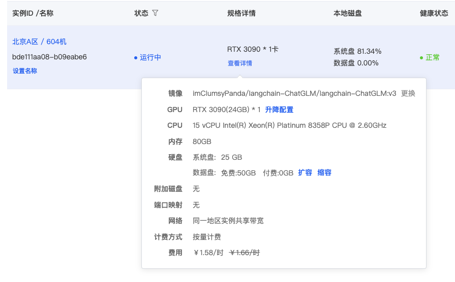

# AutoDL算力云

## 1. 什么是AutoDL算力云？

AutoDL算力云是一款基于AutoDL技术的云端算力服务，用户可以通过AutoDL算力云快速完成模型的训练和部署，无需关注模型的调参和部署，只需上传数据集，选择模型类型，即可完成模型的训练和部署。

## 2. AutoDL算力云的优势

- **快速**：AutoDL算力云提供了一键式的模型训练和部署，用户只需上传数据集，选择模型类型，即可完成模型的训练和部署，无需关注模型的调参和部署，大大提高了模型的训练和部署效率。
- **高效**：AutoDL算力云提供了多种模型类型，用户可以根据自己的需求选择合适的模型类型，同时AutoDL算力云提供了多种模型的训练和部署方式，用户可以根据自己的需求选择合适的训练和部署方式，大大提高了模型的训练和部署效率。

## 3. AutoDL算力云收费标准

- RTX 3090

## 4. AutoDL算力云的服务

- GPU算力
- [CodeWithGPU](https://www.codewithgpu.com/image) 算法社区

## 5. AutoDL使用流程

参考: <https://www.codewithgpu.com/i/imClumsyPanda/langchain-ChatGLM/langchain-ChatGLM>
