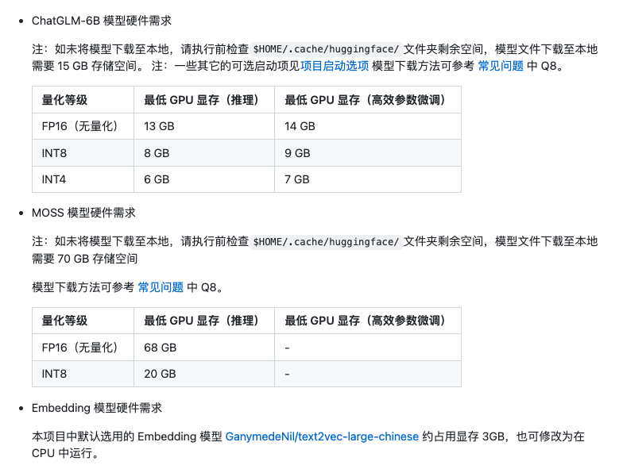
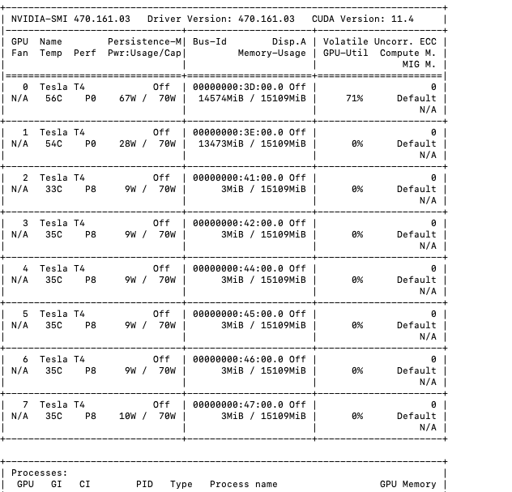
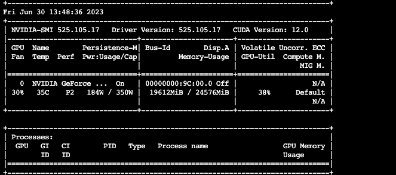

# Langchain-ChatGLM

## 资源

- 文档：<https://github.com/imClumsyPanda/langchain-ChatGLM/blob/master/README.md>
- 视频介绍： <https://www.bilibili.com/video/BV13M4y1e7cN/?share_source=copy_web&vd_source=e6c5aafe684f30fbe41925d61ca6d514>

## 硬件需求

> [源文档](https://github.com/imClumsyPanda/langchain-ChatGLM#%E7%A1%AC%E4%BB%B6%E9%9C%80%E6%B1%82)

## AutoDL部署

参考步骤:

<https://www.codewithgpu.com/i/imClumsyPanda/langchain-ChatGLM/langchain-ChatGLM>

## 流程详解

### 1. 私有数据解析

### 2. 向量数据库库解析

### 3. LLM模型导入

## 实测记录

- 模型: ChatGLM-6B
- 模式: LLM
- 问题: "用Golang实现一个AVL算法"

### AutoDL

1. 资源配置

- 8卡 Tesla T4
- 单卡显存: 15G

2. 测试数据

- 内存溢出

### 内部环境

1. 资源配置

- 单卡 RTX 3090
- 单卡显存: 24G

2. 测试数据

- 结果正常

